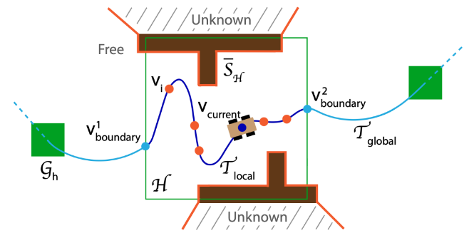
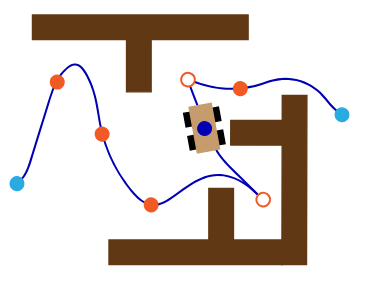
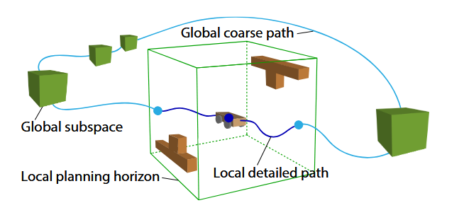

# TARE: A Hierarchical Framework for Efficiently Exploring Complex 3D Environments 
## https://www.hongbiaoz.com/files/paper5.pdf

开始，创建一个空的全局地图，采集点云信息，检测可通行空间，将可通行空间以固定大小划分为一个个子空间（如8m×8m×5m），全局地图由子空间组成，随探索不断扩大。子空间只包含状态、表面信息、质心位置，其中状态分为未探索、已覆盖、未覆盖。

同时会统计在当前位置点云探测到的表面（如墙壁），计算每一个表面的中心点Ps、法向量Ns、表面面积area，存入表面集合S中。

感知到表面，会根据当前机器狗的坐标点(视点)V，计算狗到每个表面的距离以及狗的朝向与表面的角度，若距离小于阈值同时角度小于阈值，认为狗在这个视点可以看到表面的信息，则这个表面已覆盖（也会设置多个视点都满足才覆盖）。
$$
|p_s - p_v| \leq D
$$

$$
\frac{n_s \cdot (p_v - p_s)}{|n_s| \cdot |p_v - p_s|} \geq T
$$v

## 局部规划

在机器狗所处的局部空间H，C_trav是局部空间H内考虑平移和旋转的构形空间，在C_trav中进行视点采样，等距采如5×5×3个视点，作为候选视点V。

接下来会计算每个候选视点的奖励函数A_v，A_v是视点所能覆盖的所有表面面积。一个候选视点会计算当前所有的未覆盖表面的距离约束和角度约束，若可以覆盖表面，则加上该表面面积。

设置优先队列Q，按照奖励对候选视点进行排序。

进入迭代，每次迭代都会随机的从优先队列Q中选择一个候选视点v'出来，该视点的覆盖表面会与其他视点的覆盖表面重叠，因此会更新优先队列Q中候补视点的奖励。直到优先队列Q为空或者奖励已经足够小。对得到的一组视点接下来会计算走完需要的平滑路径和代价。在所有迭代中保留最小代价的路径。

#  路径生成和平滑

对于一组视点V',通过A*算法求出每两点之间的最短路径，并构造包含所有点的距离矩阵。接着求解旅行商问题（TSP）得到访问所有视点的最短顺序。

初始化所有视点间的路线为折线，将除了第一个视点和最后一个视点外的n-2个视点当作断点。

对每段路径进行平滑操作，同时计算总的代价c

进入迭代，对视点V2到Vn-1，临时设置Vi为内点，连接Vi两端的视点，将这段路径平滑（经过Vi），计算此时的代价c'，若c'小于c同时这段平滑路径满足机器狗移动的曲率限制，则将该点设置为内点。

内点是机器狗在该点可以不停下平滑通过，断点是在此停下进行转向。

#  全局规划

全局地图由一个个子空间组成，局部空间H外的子空间可以分为三种状态，不包含已覆盖和未覆盖表面的即未知的子空间为未探索状态，只包含已覆盖表面的为已探索状态，存在未覆盖表面的子空间为探索中状态。全局规划仅关注探索中状态的子空间。

G'为探索中子空间的集合。全局规划目的是寻找经过机器狗当前视点V_current和G'中每个子空间重心的路径。

计算过程：仿照路径生成中，使用A*算法计算任意两个子空间重心之间的最短路径，并通过求解旅行商问题得到访问所有视点的最短顺序。

将路线与子空间边界的交点表示为V1_boundary和V2_boundary，接着将全局规划的路径和局部规划的路径连接起来得到整体路径。

此时局部空间内的路径简化为机器狗当前视点V'到边界视点V_boundary的路径。即到下一个子空间。

探索终止条件为所有表面均以覆盖。
